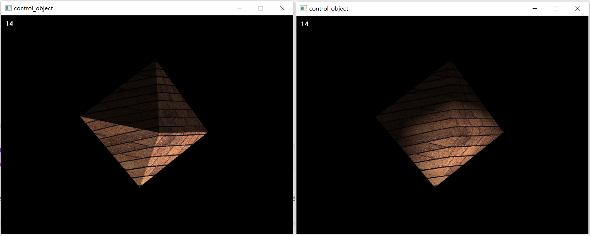

之前实习的时候做的图形学入门项目，[图形学自学任务 - 百度文库 (baidu.com)](https://wenku.baidu.com/view/ec42d707bceb19e8b9f6ba13.html)

需要库文件[EasyX Graphics Library for C++](https://easyx.cn/)

键位

1：锁定相机观察点

2：解锁相机观察点

3：使用面法向量着色（默认，物体会棱角分明）

4：使用插值的法向量着色（物体会圆润）

WA SD QE：控制相机位置

UJ IK OL：控制物体旋转

`geometry.h`定义了向量类，矩阵类和运算

`transformation.h`定义了四个变换矩阵

`object.h`定义了物体类

`render_preview3`定义了渲染器

TODO：

以后有时间重构一下，加入高光。现在光照计算是在世界空间，如果加入高光，最好在观察空间进行光照计算，好处是 cam 坐标是原点。

参考：

[吃人的博客_剑 来!_CSDN博客-计算机图形学笔记,演化算法,视图变换领域博主](https://blog.csdn.net/qq_38065509)

[Home · ssloy/tinyrenderer Wiki · GitHub](https://github.com/ssloy/tinyrenderer/wiki)
